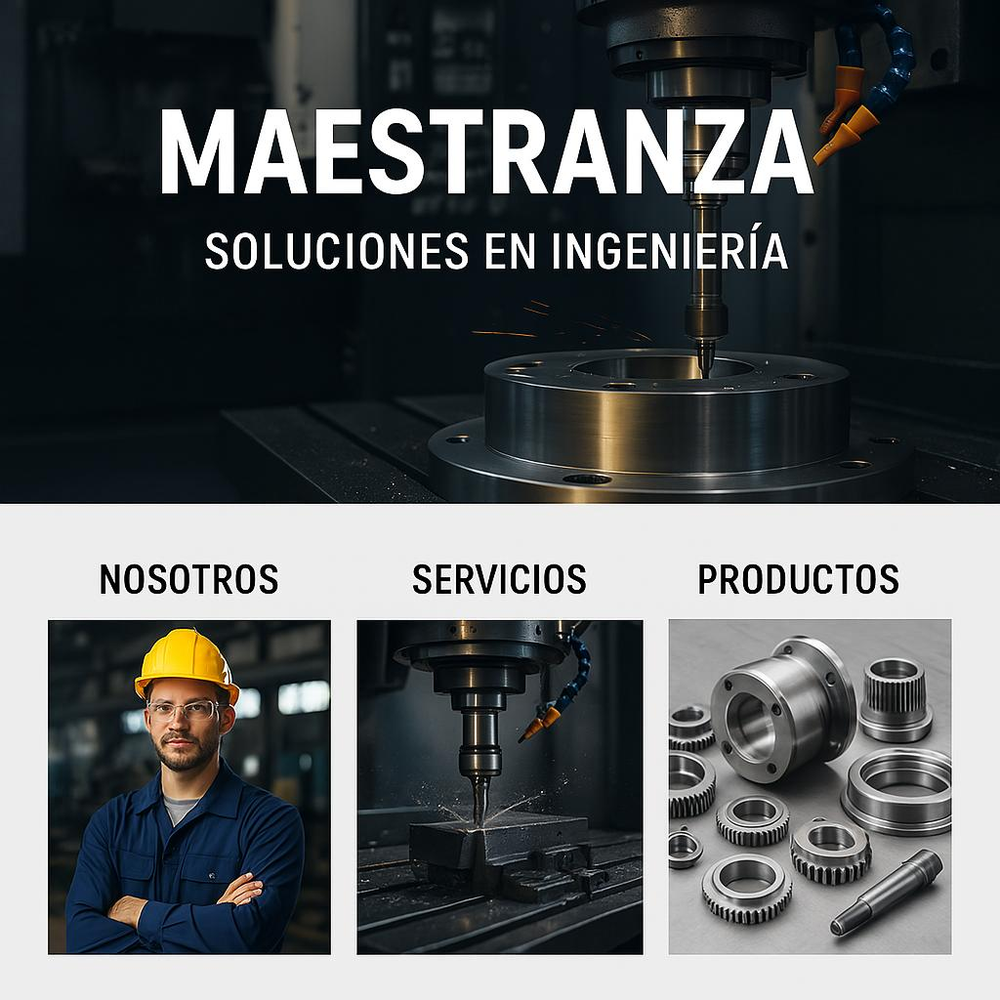

## PENDIENTE

* [ ] Pendiente: Se buscará rehacer formato/estructura de la página (nuevo diseño solicitado)  
  

---
* [ ] Cambio del titular de la página + logo de la empresa (H1 - "SERMEC" [LOGO]), y como H2 "MAESTRANZA NAVAL"
* [ ] Incluir fotos solicitadas sobre maquinaria que se opera en la empresa
* [ ] Cambiar la forma en la que sale el link en la barra de búsqueda ["WWW.Maestranzanaval.cl" (revisar implementación sobre "www")]
* [ ] Datos adicionales a incluir (consultar antes de la implementación), implementación de dirección del correo ("Sermec1097@gmail.com"), como la de un número de celular fijo ("65 2250263")
---
Aunque nuestro objetivo es desarrollar una página estática (sin interacción directa con el usuario), que se utilizará para promocionar la empresa de manera independiente de la plataforma actual de gestión empresarial, es necesario adquirir un nuevo dominio o actualizar el plan de hosting que actualmente poseemos. ¿Por qué? Porque sin la adquisición de un dominio adicional, los problemas previamente mencionados continuarán ocurriendo.

El propósito de este nuevo dominio será exclusivamente publicitario, enfocado en promover la empresa. Inicialmente, se implementará una página estática que, mediante la base de datos proporcionada por el servicio de hosting, nos permitirá llevar un registro de métricas. Estas métricas nos permitirán analizar la cantidad de usuarios que acceden al sitio, con la posibilidad de obtener estadísticas diarias, semanales, mensuales o trimestrales, según lo que se requiera.

Adicionalmente, en relación con el enlace de la página de gestión, es posible realizar modificaciones en la URL, ya que actualmente lleva el nombre "maestranzanaval", que es precisamente el mismo nombre que deseamos utilizar para la página publicitaria. Uno de los cambios más relevantes será, por lo tanto, la actualización de esta URL para reflejar el nombre deseado en ambas plataformas.
---

### PARA IMPLEMENTAR

**Servicios:**  
| Reparación de hélices marinas | Servicios de mecanizado torno CNC | Servicios de mecanizado de piezas hasta 8 metros de largo |
|:-----------------------------:|:---------------------------------:|:---------------------------------------------------------:|
| .png) | .png) | .png) |

| Foto limpia | Flexímetro de ejes |
|:----------:|:------------------:|
| .png) | .png) |

**Productos:**  
Hélices fundición hechas en Chile

| Antes | Después |
|:-----:|:-------:|
| .png) | .png) |

| Fabricación de línea de propulsión | Winche doble cabezo | Winche de Ancla |
|:----------------------------------:|:-------------------:|:---------------:|
| .png) | .png) | .png) |

| Imagen referencia | Winche de Rampa |
|:-----------------:|:---------------:|
| .png) | .png) |

| Foto limpia/arreglada | Winche capacidad de carga 40 ton | Foto limpia/arreglada |
|:---------------------:|:-------------------------------:|:---------------------:|
| .png) | .png) | .png) |

---